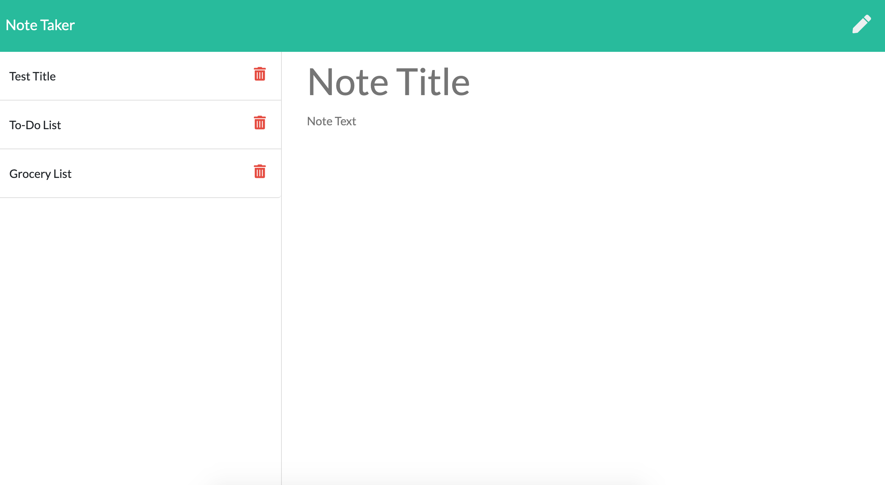

# Note Taker

## Description

This application uses Javascript and Node.js to create a note-taking website that allows the user to save notes and access them even after exiting the webpage. The user can also delete notes as needed.

Github repository: https://github.com/jordanmorse/notetaker

Deployed via Heroku: https://peaceful-escarpment-78850.herokuapp.com/

## Installation

Ensure that Node is installed (npm install) as well as the express and uuid (npm install uuid) packages in order to assign IDs and set up the server.

